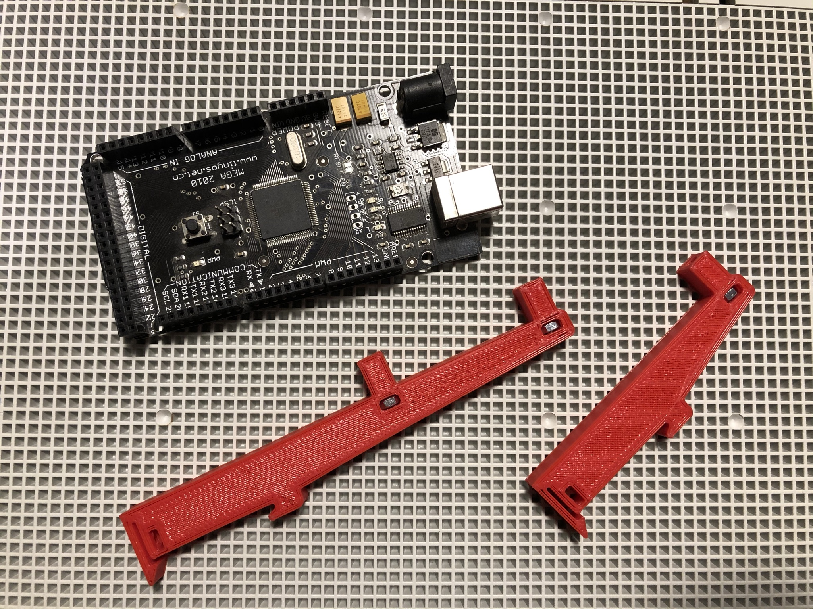
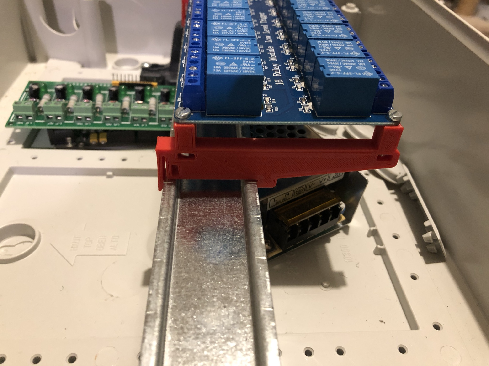
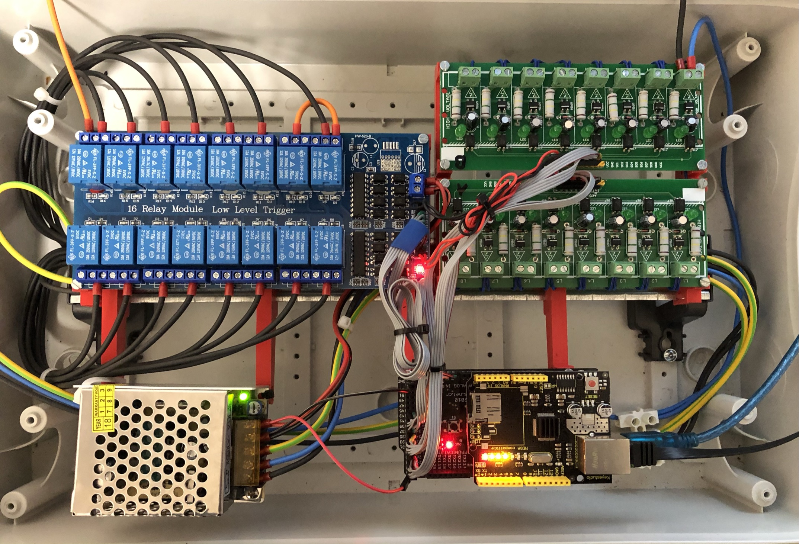

# KASA
Domotic system based AVR ATmega1280 running FreeRTOS 9.

Currently based on an older Arduino Mega 1280 clone board and a W5100 shield clone, uses optocoupled inputs to
be able to be quickly swapped on previously installed electrical panel, based on comon bistable relays activated by
mains voltage push buttons.

Built and burnt with cmake.
Configured for older Arduino bootloader (57600 baud), avrdude settings available in CMakeList.txt

### Software capabilities
 - Timed outputs
 - Constraint outputs (for motorized shutters/curtains)
 - MQTT control _(WIP)_
 - Alexa/GHome Integration _(WIP)_

### Current hardware
 - Arduino Mega 1280
 - Wiznet W5100 (Arduino Ethernet shield)
 - 8x 230V/5V optocoupler board (x2) _(connected to PORTA and PORTC)_
 - 16x 5V coil, 230V10A relay board _(connected to PORTK and PORTL)_
 - 5V2A PSU
 - DIN rail electrical box and custom 3D printed DIN headers
 
#### Future improvements
 - Custom PCB
 
#### Credits
[feilipu's](https://github.com/felipu) FreeRTOS port [avrfreertos](https://github.com/feilipu/avrfreertos)

